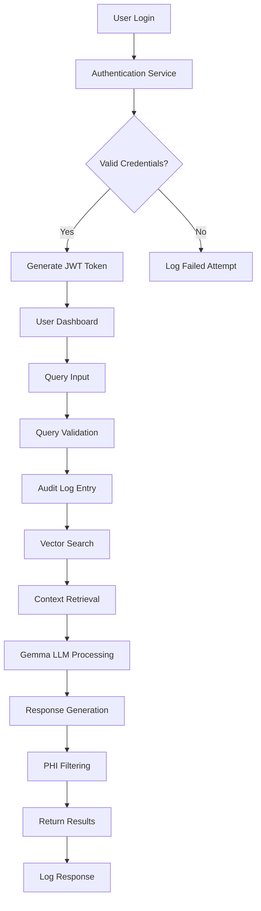
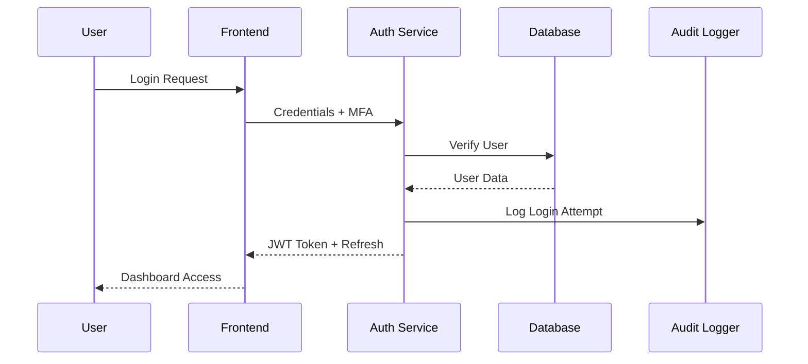

# Orthopedics EMR RAG System - Architecture & Implementation Plan

## Executive Summary

This document outlines the architecture and implementation plan for a HIPAA-compliant, locally-deployed RAG (Retrieval-Augmented Generation) system for an orthopedics practice. The system will provide intelligent search and clinical decision support using local EMR data while maintaining strict security and compliance requirements.

## Table of Contents
1. [System Overview](#system-overview)
2. [HIPAA Compliance Requirements](#hipaa-compliance-requirements)
3. [Architecture Design](#architecture-design)
4. [Database Design](#database-design)
5. [Security Architecture](#security-architecture)
6. [User Interface Design](#user-interface-design)
7. [Implementation Roadmap](#implementation-roadmap)
8. [Operational Requirements](#operational-requirements)

---

## 1. System Overview

### 1.1 Purpose
Develop a local, airgapped EMR intelligence system that enables orthopedic clinicians to:
- Query patient records using natural language
- Find similar cases and treatment outcomes
- Access clinical decision support
- Generate evidence-based recommendations
- Maintain complete HIPAA compliance

### 1.2 Key Requirements
- **Airgapped Deployment**: No external network connectivity
- **HIPAA Compliant**: Full PHI protection and audit trails
- **Role-Based Access**: Different permissions for physicians, residents, staff
- **Real-time Performance**: Sub-second response times
- **Orthopedics Focus**: Specialized for musculoskeletal medicine

### 1.3 System Constraints
- Local hardware: MacBook M3 Pro (development), dedicated server (production)
- Existing PostgreSQL infrastructure
- No cloud dependencies
- 99.9% uptime requirement during clinic hours

---

## 2. HIPAA Compliance Requirements

### 2.1 Administrative Safeguards
- **Access Management**: Unique user identification and authentication
- **Workforce Training**: Security awareness and HIPAA training protocols
- **Contingency Plan**: Data backup and disaster recovery procedures
- **Security Officer**: Designated HIPAA security officer role

### 2.2 Physical Safeguards
- **Facility Access Controls**: Restricted server room access
- **Device Controls**: Workstation security and automatic logoff
- **Media Controls**: Secure handling of storage devices

### 2.3 Technical Safeguards
- **Access Control**: Role-based authentication and authorization
- **Audit Controls**: Comprehensive logging of all system activities
- **Integrity**: Data accuracy and completeness protection
- **Person/Entity Authentication**: Secure user verification
- **Transmission Security**: Encryption of data in transit

### 2.4 Specific Implementation Requirements
```yaml
Encryption:
  - At Rest: AES-256 encryption for all databases
  - In Transit: TLS 1.3 for all communications
  - Key Management: Hardware security module (HSM) or equivalent

Audit Logging:
  - User Authentication: Login/logout events
  - Data Access: All PHI queries and retrievals
  - System Changes: Configuration and user management
  - Failed Attempts: Security breach detection

Access Controls:
  - Multi-Factor Authentication: Required for all users
  - Session Management: 15-minute idle timeout
  - Minimum Password Requirements: 12 characters, complexity rules
  - Role-Based Permissions: Granular access control
```

---

## 3. Architecture Design

### 3.1 System Components

```
┌─────────────────────────────────────────────────────────────┐
│                    Orthopedics EMR RAG System              │
├─────────────────────────────────────────────────────────────┤
│  Frontend Layer                                             │
│  ┌─────────────┐  ┌─────────────┐  ┌─────────────┐        │
│  │ Physician   │  │ Resident    │  │ Admin       │        │
│  │ Dashboard   │  │ Interface   │  │ Panel       │        │
│  └─────────────┘  └─────────────┘  └─────────────┘        │
├─────────────────────────────────────────────────────────────┤
│  API Gateway & Security Layer                               │
│  ┌─────────────────────────────────────────────────────┐   │
│  │ FastAPI + Security Middleware                       │   │
│  │ - Authentication & Authorization                    │   │
│  │ - Audit Logging                                     │   │
│  │ - Rate Limiting                                     │   │
│  │ - Request Validation                                │   │
│  └─────────────────────────────────────────────────────┘   │
├─────────────────────────────────────────────────────────────┤
│  Application Layer                                          │
│  ┌─────────────┐  ┌─────────────┐  ┌─────────────┐        │
│  │ Custom RAG  │  │ Query       │  │ Clinical    │        │
│  │ Engine +    │  │ Processor   │  │ Workflows   │        │
│  │ Gemma LLM   │  │             │  │             │        │
│  └─────────────┘  └─────────────┘  └─────────────┘        │
│  ┌─────────────────────────────────────────────────────┐   │
│  │ Document Processing Layer (LangChain Components)    │   │
│  │ - PDF/DOCX Loaders  - Text Splitters              │   │
│  │ - Medical Document Parsers - Metadata Extraction   │   │
│  └─────────────────────────────────────────────────────┘   │
├─────────────────────────────────────────────────────────────┤
│  Data Layer                                                 │
│  ┌─────────────┐  ┌─────────────┐  ┌─────────────┐        │
│  │ PostgreSQL  │  │ ChromaDB    │  │ File        │        │
│  │ (Security)  │  │ (Vectors)   │  │ Storage     │        │
│  └─────────────┘  └─────────────┘  └─────────────┘        │
└─────────────────────────────────────────────────────────────┘
```

### 3.2 Technology Stack

**Backend Services:**
- **API Framework**: FastAPI with Pydantic validation
- **LLM Engine**: Gemma 2 9B (local deployment)
- **Vector Database**: ChromaDB with persistence
- **Security Database**: PostgreSQL 15+
- **Authentication**: JWT with refresh tokens
- **Encryption**: Cryptography library for Python
- **Document Processing**: Selective LangChain components (loaders, splitters)
- **RAG Orchestration**: Custom implementation for PHI control

**Frontend:**
- **Framework**: React 18+ with TypeScript
- **UI Components**: Medical-focused component library
- **State Management**: Redux Toolkit
- **Routing**: React Router with route guards
- **Charts**: Recharts for analytics visualization

**Infrastructure:**
- **Deployment**: Docker containers with orchestration
- **Monitoring**: Prometheus + Grafana
- **Logging**: Structured logging with ELK stack
- **Backup**: Automated encrypted backups

### 3.3 Data Flow Architecture



---

## 4. Database Design

### 4.1 PostgreSQL Security Database Schema

**Database Name**: `ortho_emr_security`

#### 4.1.1 Users Table
```sql
CREATE TABLE users (
    user_id UUID PRIMARY KEY DEFAULT gen_random_uuid(),
    username VARCHAR(50) UNIQUE NOT NULL,
    email VARCHAR(255) UNIQUE NOT NULL,
    password_hash VARCHAR(255) NOT NULL,
    salt VARCHAR(255) NOT NULL,
    role_id UUID REFERENCES roles(role_id),
    first_name VARCHAR(100) NOT NULL,
    last_name VARCHAR(100) NOT NULL,
    npi_number VARCHAR(20) UNIQUE, -- National Provider Identifier
    license_number VARCHAR(50),
    department VARCHAR(100),
    is_active BOOLEAN DEFAULT true,
    last_login TIMESTAMP WITH TIME ZONE,
    password_changed_at TIMESTAMP WITH TIME ZONE DEFAULT CURRENT_TIMESTAMP,
    failed_login_attempts INTEGER DEFAULT 0,
    locked_until TIMESTAMP WITH TIME ZONE,
    created_at TIMESTAMP WITH TIME ZONE DEFAULT CURRENT_TIMESTAMP,
    updated_at TIMESTAMP WITH TIME ZONE DEFAULT CURRENT_TIMESTAMP
);
```

#### 4.1.2 Roles Table
```sql
CREATE TABLE roles (
    role_id UUID PRIMARY KEY DEFAULT gen_random_uuid(),
    role_name VARCHAR(50) UNIQUE NOT NULL,
    description TEXT,
    permissions JSONB NOT NULL, -- Flexible permissions structure
    created_at TIMESTAMP WITH TIME ZONE DEFAULT CURRENT_TIMESTAMP,
    updated_at TIMESTAMP WITH TIME ZONE DEFAULT CURRENT_TIMESTAMP
);

-- Seed roles
INSERT INTO roles (role_name, description, permissions) VALUES
('attending_physician', 'Full access to all patient data and system functions', 
 '{"read": "*", "write": "*", "admin": true}'),
('resident', 'Limited access to assigned patients and supervised functions',
 '{"read": "assigned_patients", "write": "notes_only", "admin": false}'),
('nurse', 'Access to patient care data and documentation',
 '{"read": "patient_care", "write": "care_notes", "admin": false}'),
('admin', 'System administration without patient data access',
 '{"read": "system_only", "write": "system_config", "admin": true}');
```

#### 4.1.3 Audit Logs Table
```sql
CREATE TABLE audit_logs (
    log_id UUID PRIMARY KEY DEFAULT gen_random_uuid(),
    user_id UUID REFERENCES users(user_id),
    session_id VARCHAR(255),
    action_type VARCHAR(50) NOT NULL, -- LOGIN, QUERY, ACCESS, MODIFY, etc.
    resource_type VARCHAR(50), -- PATIENT, DOCUMENT, SYSTEM, etc.
    resource_id VARCHAR(255), -- Patient ID, Document ID, etc.
    query_text TEXT, -- For RAG queries
    ip_address INET,
    user_agent TEXT,
    success BOOLEAN NOT NULL,
    error_message TEXT,
    response_time_ms INTEGER,
    phi_accessed BOOLEAN DEFAULT false,
    risk_score INTEGER CHECK (risk_score >= 0 AND risk_score <= 100),
    metadata JSONB, -- Additional context
    created_at TIMESTAMP WITH TIME ZONE DEFAULT CURRENT_TIMESTAMP
);

-- Indexes for performance
CREATE INDEX idx_audit_logs_user_id ON audit_logs(user_id);
CREATE INDEX idx_audit_logs_created_at ON audit_logs(created_at);
CREATE INDEX idx_audit_logs_action_type ON audit_logs(action_type);
CREATE INDEX idx_audit_logs_phi_accessed ON audit_logs(phi_accessed);
```

#### 4.1.4 Sessions Table
```sql
CREATE TABLE sessions (
    session_id VARCHAR(255) PRIMARY KEY,
    user_id UUID REFERENCES users(user_id),
    token_hash VARCHAR(255) NOT NULL,
    refresh_token_hash VARCHAR(255),
    ip_address INET,
    user_agent TEXT,
    is_active BOOLEAN DEFAULT true,
    expires_at TIMESTAMP WITH TIME ZONE NOT NULL,
    last_activity TIMESTAMP WITH TIME ZONE DEFAULT CURRENT_TIMESTAMP,
    created_at TIMESTAMP WITH TIME ZONE DEFAULT CURRENT_TIMESTAMP
);
```

### 4.2 ChromaDB Vector Storage

**Collection Structure:**
```python
collections = {
    "patient_documents": {
        "metadata": ["patient_id", "document_type", "date", "provider_id"],
        "encryption": "AES-256",
        "access_control": "rbac_enabled"
    },
    "clinical_protocols": {
        "metadata": ["procedure_type", "specialty", "evidence_level"],
        "encryption": "AES-256",
        "public_access": True
    }
}
```

---

## 5. Security Architecture

### 5.1 Authentication Flow



### 5.2 Data Encryption Strategy

**At Rest:**
- PostgreSQL: TDE (Transparent Data Encryption)
- ChromaDB: File-level encryption with LUKS
- Backups: GPG encryption with rotating keys

**In Transit:**
- TLS 1.3 for all HTTP communications
- Certificate pinning for API calls
- VPN for administrative access

**In Memory:**
- Secure memory allocation for sensitive data
- Memory wiping after use
- Process isolation

### 5.3 Access Control Matrix

| Role | Patient Data | System Config | Audit Logs | RAG Queries | Admin Functions |
|------|--------------|---------------|------------|-------------|-----------------|
| Attending | Full Access | Read Only | Own Logs | Unlimited | No |
| Resident | Assigned Only | No Access | Own Logs | Rate Limited | No |
| Nurse | Care Data Only | No Access | Own Logs | Care Related | No |
| Admin | No Access | Full Access | All Logs | None | Full |

---

## 6. User Interface Design

### 6.1 Dashboard Layout

**Physician Dashboard:**
```
┌─────────────────────────────────────────────────────────┐
│ Header: Logo | User Info | Notifications | Logout      │
├─────────────────────────────────────────────────────────┤
│ ┌─────────────┐ ┌─────────────────────────────────────┐ │
│ │ Quick       │ │ RAG Query Interface                 │ │
│ │ Actions     │ │ ┌─────────────────────────────────┐ │ │
│ │ - New Query │ │ │ "Find similar ACL repair cases │ │ │
│ │ - Patient   │ │ │  with complications in the last │ │ │
│ │   Search    │ │ │  6 months"                      │ │ │
│ │ - Recent    │ │ └─────────────────────────────────┘ │ │
│ │   Cases     │ │ [Search] [Advanced] [Templates]     │ │
│ └─────────────┘ └─────────────────────────────────────┘ │
├─────────────────────────────────────────────────────────┤
│ Recent Activity | Bookmarked Cases | System Status    │
└─────────────────────────────────────────────────────────┘
```

### 6.2 Query Results Interface

**Search Results Display:**
- **Patient Context**: De-identified patient summaries
- **Relevance Scoring**: Confidence indicators
- **Source Attribution**: Document references
- **Similar Cases**: Related patient outcomes
- **Clinical Insights**: AI-generated recommendations

### 6.3 Mobile Responsiveness

- Progressive Web App (PWA) for mobile access
- Touch-optimized interface for tablets
- Offline capability for critical functions
- Secure session handling on mobile devices

---

## 7. Implementation Roadmap

### Phase 1: Infrastructure Setup (Weeks 1-2)
- [ ] PostgreSQL security database setup
- [ ] ChromaDB vector database configuration
- [ ] Basic authentication system
- [ ] Development environment setup
- [ ] Initial security hardening

### Phase 2: Core Backend Development (Weeks 3-5)
- [ ] FastAPI application structure
- [ ] User management and RBAC implementation
- [ ] Audit logging system
- [ ] RAG query processing engine
- [ ] Gemma model integration

### Phase 3: Frontend Development (Weeks 4-6)
- [ ] React application setup
- [ ] Authentication UI components
- [ ] Dashboard and query interface
- [ ] Results visualization
- [ ] Mobile responsive design

### Phase 4: Security Implementation (Weeks 6-7)
- [ ] Encryption implementation
- [ ] Security middleware
- [ ] Vulnerability testing
- [ ] Penetration testing
- [ ] HIPAA compliance audit

### Phase 5: Orthopedics Customization (Weeks 7-8)
- [ ] Medical terminology processing
- [ ] Clinical workflow integration
- [ ] Document type specialization
- [ ] Query template library
- [ ] Outcome tracking features

### Phase 6: Testing & Deployment (Weeks 9-10)
- [ ] Comprehensive testing suite
- [ ] Performance optimization
- [ ] User acceptance testing
- [ ] Production deployment
- [ ] Staff training materials

### Phase 7: Go-Live & Support (Week 11+)
- [ ] Production monitoring setup
- [ ] User training sessions
- [ ] Incident response procedures
- [ ] Performance monitoring
- [ ] Continuous improvement process

---

## 8. Operational Requirements

### 8.1 Hardware Requirements

**Development Environment:**
- MacBook M3 Pro (current setup)
- 36GB RAM, 1TB+ SSD
- Local development and testing

**Production Environment:**
- Dedicated server with:
  - 64GB+ RAM for ML model hosting
  - 2TB+ NVMe SSD for database storage
  - GPU acceleration (optional, for faster inference)
  - Redundant power and cooling
  - Physical security measures

### 8.2 Backup and Recovery

**Backup Strategy:**
- Real-time replication for critical data
- Daily encrypted backups to secure storage
- Weekly full system backups
- Monthly disaster recovery testing
- Offsite backup storage (encrypted)

**Recovery Objectives:**
- RTO (Recovery Time Objective): 4 hours
- RPO (Recovery Point Objective): 1 hour
- Mean Time to Recovery: < 2 hours

### 8.3 Monitoring and Alerting

**System Monitoring:**
- Application performance metrics
- Database performance and storage
- Security event monitoring
- User activity analytics
- Resource utilization tracking

**Alert Categories:**
- Security incidents (immediate)
- System failures (immediate)
- Performance degradation (15 minutes)
- Capacity warnings (daily)
- Compliance issues (immediate)

### 8.4 Maintenance Windows

**Scheduled Maintenance:**
- Weekly: Security updates (non-clinic hours)
- Monthly: System optimization and cleanup
- Quarterly: Comprehensive security review
- Annually: Full disaster recovery test

---

## Conclusion

This architecture provides a comprehensive foundation for a HIPAA-compliant orthopedics EMR RAG system. The design emphasizes security, compliance, and clinical usability while maintaining local deployment requirements.

**Next Steps:**
1. Review and approve architecture
2. Set up development environment
3. Begin Phase 1 implementation
4. Establish security protocols
5. Create development timeline

**Success Metrics:**
- 100% HIPAA compliance audit pass
- Sub-second query response times
- 99.9% system uptime during clinic hours
- Positive user adoption and satisfaction
- Measurable improvement in clinical workflows